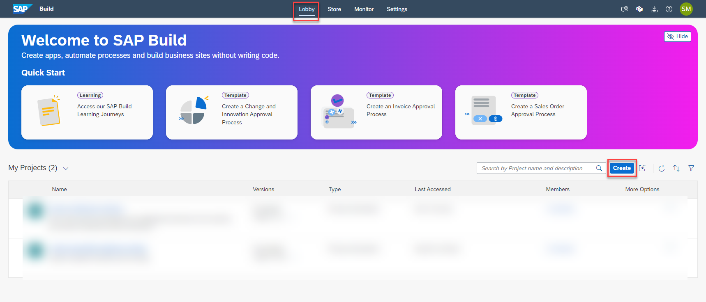

## Create SAP Build Process Automation - Decisions Project
In this section, you will configure SAP Business Rule project which will be used to determine which business action should be executed for an event. Additionally, based on your scenario you can create decision tables and business rules.

### 1. Create SAP Build Process Automation Project

1. In the SAP BTP Cockpit, Navigate to your subaccount -> **Sevices** -> **Instances and Subscriptions** , Open the SAP Build Process Automation Application.

    

2. In the SAP Build Process Automation Application, In the **Lobby** Tab , Click on **Create** button to create a new project.

    

3. Choose the **Build am Automated Process Tile**, and then choose **Business Process** Tile.

    

    
