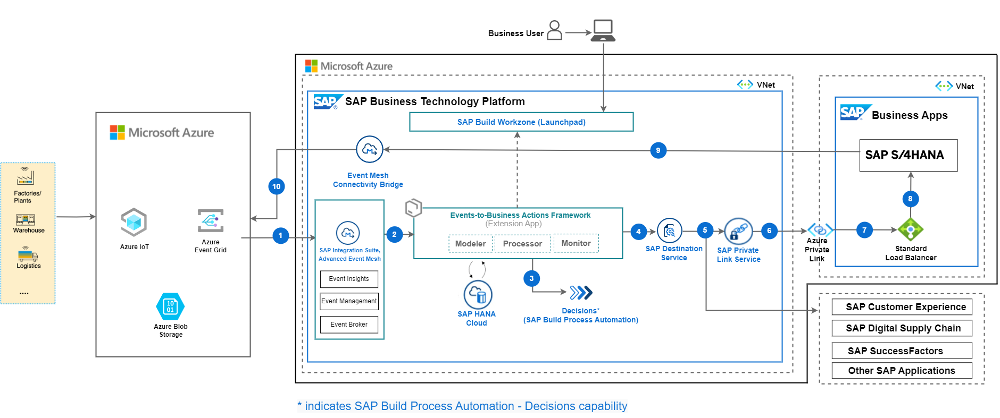
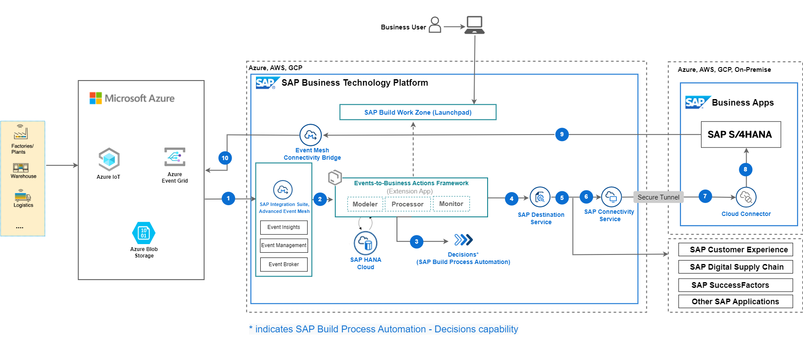

# IN263 - Support Industry 4.0 with Event-Driven Architecture   

## Description    

This repository contains the material for the SAP TechEd 2023 session called IN263 - Support Industry 4.0 with Event-Driven Architecture.

## Overview  

This session introduces attendees to a event-driven Industry 4.0 business scenario where they will implement Events-to-Business-Actions framework built on SAP BTP to inetgrate real time events generated from Microsoft Azure IOT Central into SAP Business Processes to enrich the outcome of enterprise operations and facilitate rapid decision making. This Events-to-Business-Actions framework can be used in combination with any hyperscaler or telco IOT.

## Business Process Flow

In this event-driven scenario, based on the real-time status of the IoT Devices , actionable events are sent to SAP BTP to decide on the critical business actions to be taken in the SAP Enteprise Business systems based on business rules defined in the system.

1. Data from IoT Devices are sent to Microsoft Azure IoT Central.   
   In this session, a waste container/silo is used which sends fill level information to IOT central.

2. Rules in Microsoft Azure IoT triggers an call to SAP Integration Suite, Advanced Event Mesh in case of any events which needs attention. This is defined in IoT Rules for devices.

3. SAP Integration Suite, Advanced Event Mesh receives the events.

4. Extension application of Event-To-Business=Actions framework is configured with all necessary actions (For example, calling SAP Build Process Automation - Decisions capability API to read the decision tables to decide on action to be taken, configure the OData API call to be executed , service call back to the device) to be taken.

5. Extension application executes the business actions.

6. For this sample application, based on the fill level of waste container/silo a new Purchase Order Requisition is created in SAP S/4HANA.

## Table of Contents

[Scenario](#scenario)\
[Business Process Flow](#business-process-flow)\
[Solution Architecture](#solution-architecture)\
[Implementation: Configuration and Development](#configuration-and-development)\
[Additional Resources](#additional-resources)\
[Known Issues](#known-issues)\
[Reference](#reference)\
[Disclaimer](#disclaimer)\
[How to Obtain Support](#how-to-obtain-support)\
[Code of Conduct](#codeofconduct)\
[Contributing](#contributing)\
[License](#license)

## Solution Architecture

The key services used from Microsoft Azure are the Azure IoT Central, Azure Blob Storage, Azure Communication Service, Azure Event Grid and Azure Active Directory.

The services used from SAP BTP are the Cloud Foundry Runtime, SAP Advanced Event Mesh, SAP Build Process Automation Decisions capability, SAP Connectivity service, SAP Private Link service, SAP Workflow Management and SAP Destination service. 

SAP Private Link service is used for connectivity between SAP BTP and SAP S/4HANA when both the systems are running on Microsoft Azure Infrastructure. In this tutorial you will find implementation steps for SAP BTP Private Link service and Microsoft Azure Private Link service. Alternatively you can use SAP Connectivity service and Cloud Connector for integration of SAP BTP and SAP S/4HANA as well. 

 **Figure-1: High-level architecture (with SAP S/4HANA on Azure)**

    
 **Figure-2: High-level architecture with SAP S/4HANA on-premise and private cloud**

The following steps depicts the information flow across systems (in both the scenarios)

(1) Event is triggered from Microsoft Azure and sent to SAP Integration Suite, Advanced Event Mesh.

(2) Event-to-Business-Action framework(extension app) processor module's endpoint is subscribed to SAP Integration Suite, Advanced Event Mesh, hence receives this event.

(3) Event-to-Business-Action framework(extension app) processor module leverages the Decisions capability of SAP Build Process Automation to derive business action (for example, Purchase Order Requisition creation in SAP S/4HANA system) based on certain characteristics of incoming event.

(4), (5), (6) (7) and (8) Event-to-Business-Action framework (extension app) processor module triggers the defined action in the SAP S/4HANA system by using the SAP Destination Service and SAP Private Link Service.  

For more information, see [Set Up Connectivity Between SAP BTP and SAP S/4HANA Using SAP Private Link Service](./Documentation/Scenario1-Inbound-to-SAPS4HANA/Step4b-Setup-SAPPrivateLinkService/README.md) page.

In case SAP S/4HANA is on-premise and private cloud (refer to Figure-2)– communication with SAP S/4 HANA integrates via SAP Connectivity Service and Cloud Connector.

(9) and (10) SAP S/4HANA publishes event for Purchase Requisition creation is sent to Microsoft Azure Event Grid via SAP Event Mesh Connectivity Bridge for further processing by Microfost Azure applications.

For outbound from SAP S/4HANA scenario using SAP Integration Suite, Advanced Event Mesh Connectivity Plan(Beta), see [Integrate Events Between SAP and Microsoft using SAP Event Mesh - Connectivity Bridge Service](https://github.com/SAP-samples/btp-event-mesh-connectivity-bridge) page. You will find the detailed architecture and business scenario for SAP Integration Suite, Advanced Event Mesh and Azure Event Grid direct connectivity.

## Requirements 

These are the technical prerequistics for an integration between Microsoft Azure IoT Central, SAP BTP and SAP S/4HANA. 

**Services in SAP BTP**

- Cloud Foundry Runtime
    > - Foundation for running the CAP extension application for translating events to business actions.
- Memory/Runtime quota
    > - Required for deploying and running the extension application in SAP BTP
- Authorization & Trust Management Service
    > - Required for securing the extension application in SAP BTP
- SAP Integration Suite,Advanced Event Mesh 
    >- Required to receive events from Amazon Rekognition
- SAP HANA Cloud 
    >- Required to store action configuration and logs for CAP application
- SAP HANA Schemas & HDI Containers 
    >- Application database for CAP Application
- SAP Build Process Automation - Decisions capability
    >- SAP Build Process Automation - Decisions service to configure business decisions that needs to be taken based on the type of event received from Amazon Rekognition.
- SAP S/4HANA System
    >- To execute the business action associated with the event received. 
- SAP Connectivity Service
    >- To establish connections between cloud applications and on-premise systems.
- SAP Destination Service
    >- To find the destination information required to access a remote service or system from your extension application.
- SAP Private Link Service
    >- To establishe a private connection between selected SAP BTP services and selected services in your own IaaS provider accounts.
- SAP Business Application Studio
    >- A powerful and modern development environment, tailored for efficient development of business applications for the Intelligent Enterprise.
- SAP Event Mesh Connectivity Plan(Beta)
    >- As of now, this service supports SAP Event Mesh to Azure Event Grid direct connectivity. This is available as Beta for Enterprise accounts only for now.

**Microsoft Azure**

- A valid Microsoft Azure subscription

- A Microsoft Azure Active Directory
    > - Required for the trust between Microsoft Azure Active Directory and SAP BTP
    > - User management
    > - Application registrations to allow access to Microsoft Azure IoT Central REST API and SAP BTP

- An Azure IoT Central Service
    > - Service for configuring Azure IoT Central Application
    > - Required for configuring device template, event producer and event routing.

- An Azure Storage Account
    > - Required for storing the events received from Azure Event Grid in case of outbound from SAP S/4HANA scenario using SAP Integration Suite, Advanced Event Mesh Connecivity service.

- An Azure Communication Service
    >- Required to send email notificiations and SMS to users.

## Configuration and Development

This repository is documented for 2 scenarios:

1. Inbound to SAP S/4HANA from Azure IoT Central.
2. Outbound from SAP S/4HANA to Azure Event Grid.

These are the steps to configure SAP S/4HANA, SAP BTP and Microsoft Azure for **Scenario 1 - Inbound to SAP S/4HANA from Azure IoT Central**.

[Step 1: Set Up the Subaccount in SAP BTP](./Documentation/Scenario1-Inbound-to-SAPS4HANA/Step1-Setup-SAPBTP-Subaccount/README.md)

[Step 2: Configure Microsoft Azure IoT](./Documentation/Scenario1-Inbound-to-SAPS4HANA/Step2-Setup-AzureIoT/README.md)

[Step 3: Check SAP S/4HANA Readiness](./Documentation/Scenario1-Inbound-to-SAPS4HANA/Step3-SAPS4HANA-Readiness/README.md)

Step 4: Connect SAP BTP and SAP S/4HANA

   - [(Option 1) Using SAP BTP Connectivity Service](./Documentation/Scenario1-Inbound-to-SAPS4HANA/Step4a-SetupCloudConnector/README.md)

   - [(Option 2) Using SAP Private Link Service](./Documentation/Scenario1-Inbound-to-SAPS4HANA/Step4b-Setup-SAPPrivateLinkService/README.md)

[Step 5a: Build and Deploy the Extension Application](./Documentation/Scenario1-Inbound-to-SAPS4HANA/Step5a-Build-Deploy-ExtensionApplication/README.md)

[Step 5b: SAP Integration Suite, Advanced Event Mesh Configuration](./Documentation/Scenario1-Inbound-to-SAPS4HANA/Step5b-Advanced-Event-Mesh-Configuration/README.md)

[Step 6: Create SAP Build Process Automation - Decisions Project](./Documentation/Scenario1-Inbound-to-SAPS4HANA/Step6-Configure-BusinessRules-Part1/README.md)

[Step 7: Configure SAP S/4HANA Business Actions in the extension application](./Documentation/Scenario1-Inbound-to-SAPS4HANA/Step7-Configure-BusinessActions/README.md)

[Step 8: Update and Deploy SAP Build Process Automation Decisions Project](./Documentation/Scenario1-Inbound-to-SAPS4HANA/Step8-Configure-BusinessRules-Part2/README.md)

[Step 9: Test the Extension Application](./Documentation/Scenario1-Inbound-to-SAPS4HANA/Step9-Test-ExtensionApplication/README.md)

For **Scenario 2 - Outbound from SAP S/4HANA to Azure Event Grid**, please refer to 
[Receiving events from SAP S/4HANA in Microsoft Azure Event Grid using SAP Integration Suite, Advanced Event Mesh](./Documentation/Scenario2-Outbound-from-SAPS4HANA/README.md) link.

## Additional Resources

Related projects :

- [Events-to-Business-Actions-Framework](https://github.com/SAP-samples/btp-events-to-business-actions-framework/tree/main)

## Known Issues

No known issues.

## Reference

### Creation of Azure IoT solutions

[Azure IoT Central](https://azure.microsoft.com/en-in/products/iot-central/)

## Disclaimer

This project has been a proof of concept, including several limitations and prerequisites. The objective was to build a extension application for receiving and automating the actions in SAP S/4HANA. For this reason, the coding should not be seen as any recommendation for productive implementation. It fulfils the purpose and requirements of a proof of concept and is not intended for productive usage. It has been declared as pure proof of concept only to give the development teams ideas for solving potential challenges when integrating events from other platforms and SAP S/4HANA using SAP BTP. This can be extended to integrate with any other SAP LoB system as well.

## How to Obtain Support

[Create an issue](https://github.com/SAP-samples/<repository-name>/issues) in this repository if you find a bug or have questions about the content.
For additional support, [ask a question in the SAP Community](https://answers.sap.com/questions/ask.html).

## Contributing

If you wish to contribute code, offer fixes or improvements,  send a pull request. Due to legal reasons, contributors will be asked to accept a DCO when they create the first pull request to this project. This happens in an automated fashion during the submission process. SAP uses [the standard DCO text of the Linux Foundation](https://developercertificate.org/).

Refer to the [CONTRIBUTING](CONTRIBUTING.md) file for guidelines to contributions from external parties.

For additional support, [ask a question in the SAP Community](https://answers.sap.com/questions/ask.html).

## Code of Conduct

Refer to the [CODE OF CONDUCT](CODE_OF_CONDUCT.md) file.

## License

Copyright (c) 2022 SAP SE or an SAP affiliate company. All rights reserved. This project is licensed under the Apache Software License, version 2.0, except as noted otherwise in the [LICENSE](LICENSE) file.
